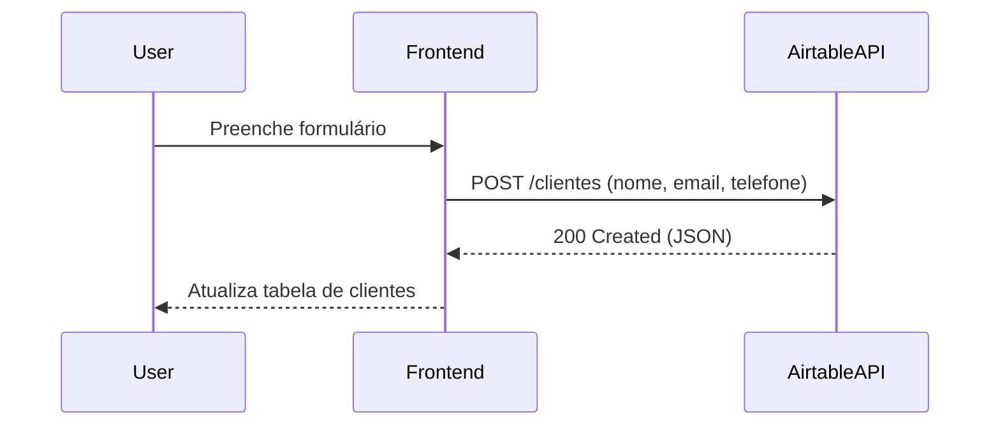

# ☁️ CloudConnect — Missão 5

## 📌 Sobre o Projeto
Um web app simples de **cadastro de clientes** com integração direta à **API do Airtable**.  
Permite **Create, Read, Update e Delete (CRUD)** de registros, trabalhando conceitos de:
- APIs REST (GET/POST/PATCH/DELETE)
- Autenticação via Token (PAT)
- JSON + Headers
- Boas práticas de segurança
- UX limpa e responsiva (design estilo Apple com glassmorphism)

---

## 🚀 Funcionalidades
✅ Listar clientes (GET)  
✅ Adicionar clientes (POST)  
✅ Editar clientes (PATCH)  
✅ Excluir clientes (DELETE)  
✅ Busca dinâmica (filterByFormula)  
✅ Configuração segura via modal (localStorage)  
✅ Estados de UI (carregando, vazio, erro)  

---

## 🛠️ Tecnologias
- HTML5, CSS3 (glassmorphism, responsivo)
- JavaScript (fetch API, DOM, localStorage)
- Airtable API (Base + Tabela)

---

## ⚙️ Configuração
1. Crie uma **Base** no Airtable chamada `DBX_CloudConnect` com a tabela `Clientes`:
   - Campos: `nome`, `email`, `telefone`
2. Gere um **PAT** (Token) no [Airtable Developer Hub](https://airtable.com/developers/web/api/introduction)
3. Abra o app (`index.html`) no navegador
4. Clique em **⚙️ Credenciais** e cole:
   - Token (PAT)
   - Base ID (ex.: `appXXXXXXXXXXXXXX`)
   - Table Name (ex.: `Clientes`)
5. Salve e pronto!

---

## 📊 Fluxo de conexão

---

## 📝 Reflexão
> "Integrar uma API real me mostrou como o frontend se conecta ao mundo externo.  
Aprendi sobre autenticação, tratamento de erros e como pequenas decisões de UX (exibir status, mensagens claras) tornam o app mais confiável e profissional."

---

🎖 **Badge desbloqueado:** *Explorador de Nuvens*  
